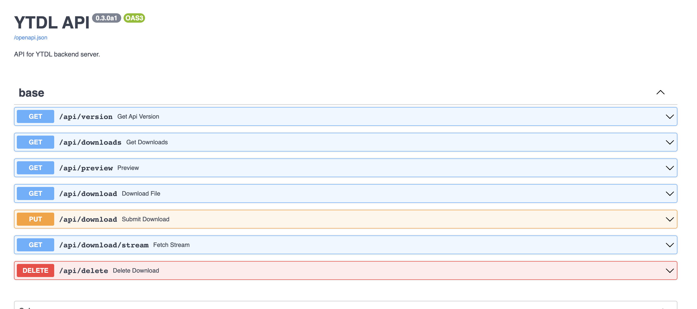

 # YTDL-API [](https://codecov.io/gh/deepaerial/ytdl-api) [](https://github.com/deepaerial/ytdl-api/actions/workflows/testing.yml)
REST-based API for downloading video or extracting audio from YouTube videos. This API is used by [YTDL](https://github.com/deepaerial/ytdl-web) web application.  Also [ffmpeg](https://ffmpeg.org/) is required in order to process video and audio files.
<br><br>



## Requirements
App requires Python 3.10 and [poetry](https://python-poetry.org/) installed. Also project relies on [Deta](https://www.deta.sh/) for storing data about downloads. So you should have account there in order to run this project.

## Installation
Run `poetry` command below to install project dependencies (including ones needed for development).
```shell
$ poetry install
```
## Launch API locally
Before starting the application server you should create `.env` file which will contain all necessary settings. Example configuration for Docker container:
```shell
DEBUG=True
ALLOW_ORIGINS="http://localhost,http://localhost:8080,http://localhost:8081,http://127.0.0.1,http://127.0.0.1:8080,http://127.0.0.1:8081"
DATASOURCE__DETA_KEY=<your Deta key should inserted here>
DATASOURCE__DETA_BASE=<your deta base name should be inserted here>
MEDIA_PATH="/app/media"
```
After you're done with configuration simply execute script below:
```shell
$ ./scripts/run_devserver.sh 
```
This will launch `uvicorn` server with app on http://localhost:8080. You will also be able to check OpenAPI (Swagger) documentation on http://localhost:8080/docs.

## Running app using docker-compose
```shell
$ docker-compose up -d ytdl-api
```

## Running tests
Before running tests for the first time create file `.env.test` inside project directory with following content. Replace placeholders with real values:
```
DATASOURCE__DETA_KEY=<your Deta key should inserted here>
STORAGE__DETA_KEY=<your Deta key should inserted here>
STORAGE__DETA_DRIVE_NAME=ytdl_test_downloads
```
Run `pytest` with command below. `--cov-report` flag will generate coverage report in HTML format.
```shell
$ pytest --cov-report html
```
## Deploy on Fly.io
1. Set up machine for app container
```shell
$ fly launch --no-deploy
```    

2. Set environmental variables
```shell
$ fly secrets import
# your secrets are passed below
DEBUG=True
ALLOW_ORIGINS="http://localhost,http://localhost:8080,http://localhost:8081,http://127.0.0.1,http://127.0.0.1:8080,http://127.0.0.1:8081"
DATASOURCE__DETA_KEY=<your Deta key should inserted here>
DATASOURCE__DETA_BASE=<your deta base name should be inserted here>
EOL
```

3. Deploy app
```shell
$ fly deploy
```

## Generating token for Github Actions
Instructions based on [this documentation page from Fly.io](https://fly.io/docs/app-guides/continuous-deployment-with-github-actions/)
1. Run the command below and copy and copy the output:
```
$ fly tokens create deploy -x 999999h
```

2. Go to repo's **Settings** -> **Security** section -> **Secrets and variables** -> **Actions**. Click **New repository secret** button and paste copied output key from previous step int **Secret** input.

## Troubleshoots
This section describes potential issues that may occur when using API.

### 1. Issue: Video is downloaded and playing but audio is absent when opening video in QuickTime Player.
**Solution:** Open video in another player (VLC Player for example). Maybe QuickTime Player doesn't support audio codec used in video.